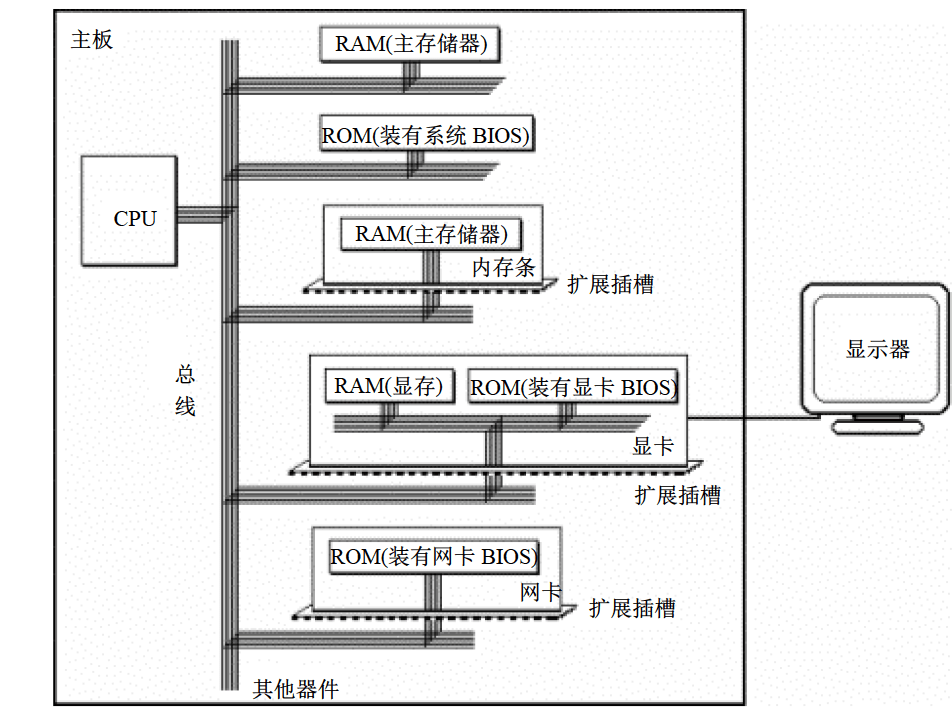

（学习用书为王爽《汇编语言(第四版)》）

# 基础知识

## 机器语言

机器语言是机器指令的集合。

由于每一种微处理器的硬件设计和内部结构不同，需要不同的电平脉冲来控制使其工作，所以每种微处理器都有其机器指令集。

## 汇编语言的组成

- 汇编指令：机器码 的助记符，有对应的机器码。（汇编语言的核心）
- 伪指令：无对应机器码，由编译器执行，计算机不执行。
- 其他符号：如+，-，*，/，由编译器识别，无对应机器码。

## 存储器

存储器中存放指令和数据，并向CPU提供指令和数据。

硬盘不同于内存，磁盘上的数据或者程序如果不读到内存中就无法被CPU使用。

## 指令和数据

本质都是二进制信息。

## 存储单元

存储单元存储1Byte(字节)，即8bit,8个二进制位。

> 1KB=1024B=2^10^B
>
> 1MB=1024KB=2^10^KB
>
> 1GB=1024MB=2^10^MB
>
> 1TB=1024GB=2^10^GB

## CPU对存储器的读写

> - 地址信息：存储单元的地址。
> - 控制信息：器件的选择，读或写的命令。
> - 数据信息：读或写的数据。

CPU通过总线将这些信息传到储存器芯片中。

总线从逻辑上分3类：

> - 地址总线
> - 数据总线
> - 控制总线

## 地址总线

CPU通过地址总线指定存储单元。

地址总线上能传送多少不同的信息，CPU就可以对多少个存储单元寻址。

10根地址总线，2^10^个二进制数据，0~1023。

地址线的根数为此CPU的地址总线宽度。

## 数据总线

数据总线的宽度决定了CPU和外界的数据传送速度（一次数据传送量）。

## 控制总线

控制总线的宽度决定了CPU对外部器件的控制能力。

## 主板

每一台PC都有一个主板，主板上有核心器件和一些主要器件：CPU，存储器，外围芯片组，扩展卡槽，扩展卡槽一般有RAM内存条和各类接口卡。

这些器件通过总线相连。

## 接口卡

CPU通过总线控制接口卡，接口卡根据CPU的指令控制外设（显示器，音箱，打印机）。

## 各类存储器芯片

从读写属性上分：

- 随机存储器（RAM）Random Access Memory

> RAM可读可写，但必须带电存储

- 只读存储器（ROM）Read-Only Memory

> 只读，关机后内容不丢失

BIOS Basic Input/Output System

显示卡上的RAM称为显存，随时向显示器输出。



## 内存地址空间

一个CPU的地址总线宽度为10，可以寻址2^10^个内存单元，内存地址空间为1KB。

> 内存地址空间=定位的存储单元个数

# 寄存器

在CPU中：

- 运算器进行信息处理
- 寄存器进行信息存储
- 控制器控制器件工作
- 内部总线连接各器件

## 通用寄存器

8086CPU有14个寄存器，AX,BX,CX,DX,SI,DI,SP,BP,IP,CS,SS,DS,ES,PSW

8086CPU的所有寄存器都是16位的=2B

AX，BX，CX，DX通常用来存放一般性的数据，称为通用寄存器。

AX可分为两个8位寄存器AH，AL

## 字在寄存器中的存储

字，记为word，由两个字节组成，分别称为高位字节和低位字节。

16进制相当于4位2进制，为区分不同进制，16进制数据后加H，2进制加B，十进制什么也不加。

## 物理地址

## 16位结构的CPU

## 段的概念

## 段寄存器

## CS和IP

# 寄存器（内存访问）

## 内存中字的存储

## DS和[address]

## 字的传送

## mov add sub指令

## 数据段

## 栈

## CPU提供的栈机制

## 栈顶超界的问题

## push pop指令

## 栈段

# 端口

## 端口的读写

# 基本语法

> - data部分
> - bss部分
> - text部分

## data部分

**data**部分用于声明初始化数据或者常量。

在运行时不会改变

声明数据部分：

```
section. data
```

## bss部分

**bss**部分用于声明变量。

声明bss部分：

```
section. bss
```

## text部分

**text**部分用于保存实际代码。

此部分必须以声明 `global _start`开头，它告诉内核程序执行的开始位置。

声明文本部分：

```
section.text
   global _start
_start:
```

## 注释

汇编语言注释以分号 (;) 开头。 它可以包含任何可打印字符，包括空白。 它可以单独出现在一行上。

```
; This program displays a message on screen
```

```
add eax, ebx     ; adds ebx to eax
```

## 汇编语言语句

- 可执行指令或说明
- 汇编器指令或伪操作
- 宏

**可执行指令**或简单的**指令**告诉处理器要做什么。 每条指令由一个**操作码**（opcode）组成。 每条可执行指令生成一条机器语言指令。

**汇编程序指令**或**伪操作**告诉汇编程序有关汇编过程的各个方面。 它们是不可执行的，并且不会生成机器语言指令。

**宏**基本上是一种文本替换机制。

---
汇编语言语句每行输入一个语句。 每个语句都遵循以下格式
```
[label]   mnemonic   [operands]   [;comment]
```

> 方括号中的字段是可选的。 基本指令由两部分组成，第一部分是要执行的指令名称（或助记符），第二部分是命令的操作数或参数。

**Hello World!**

```
section	.text
   global _start     ;must be declared for linker (ld)
	
_start:	            ;tells linker entry point
   mov	edx,len     ;message length
   mov	ecx,msg     ;message to write
   mov	ebx,1       ;file descriptor (stdout)
   mov	eax,4       ;system call number (sys_write)
   int	0x80        ;call kernel
	
   mov	eax,1       ;system call number (sys_exit)
   int	0x80        ;call kernel

section	.data
msg db 'Hello, world!', 0xa  ;string to be printed
len equ $ - msg     ;length of the string
```

