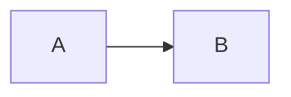
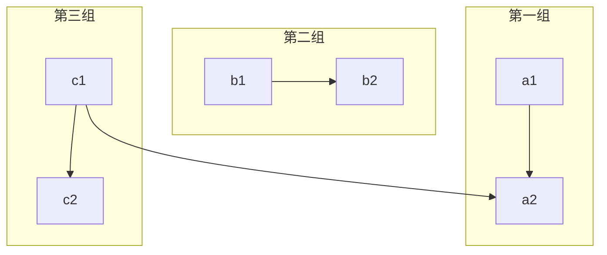
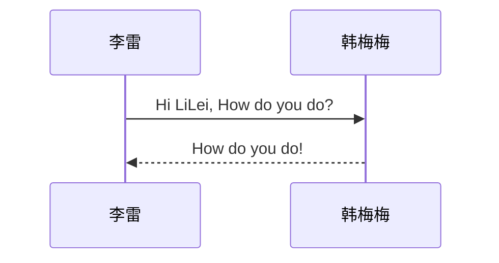
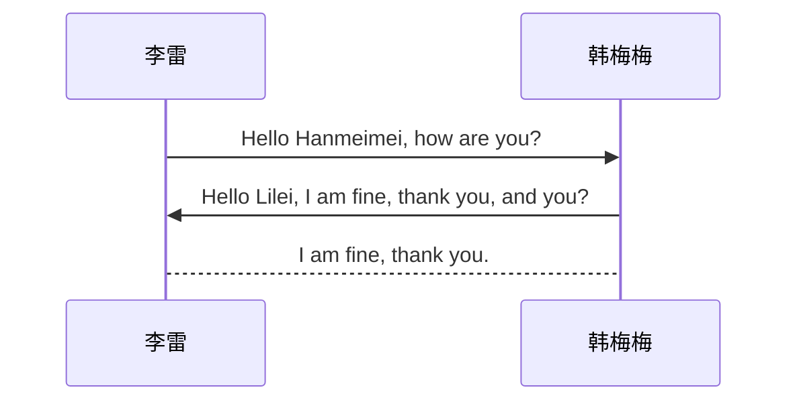
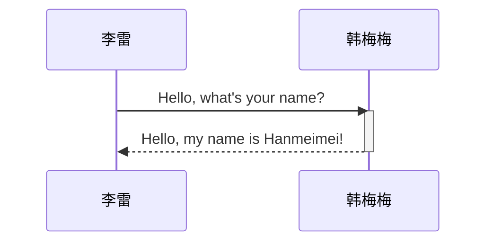
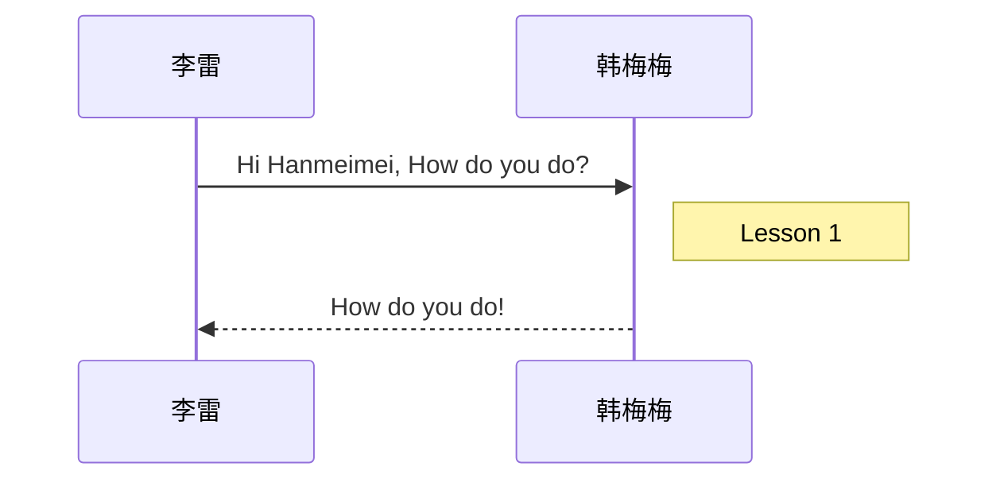
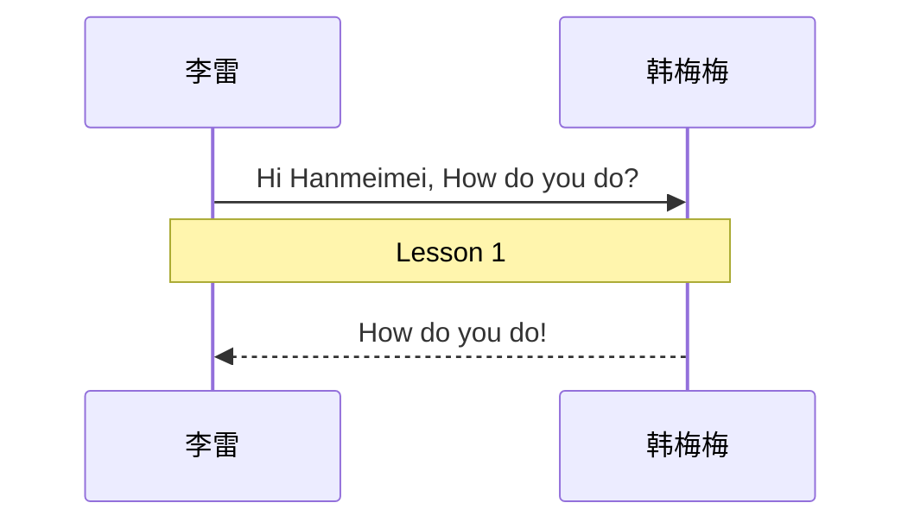
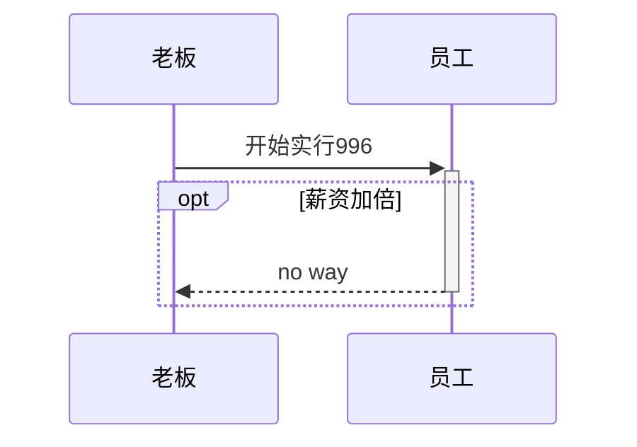
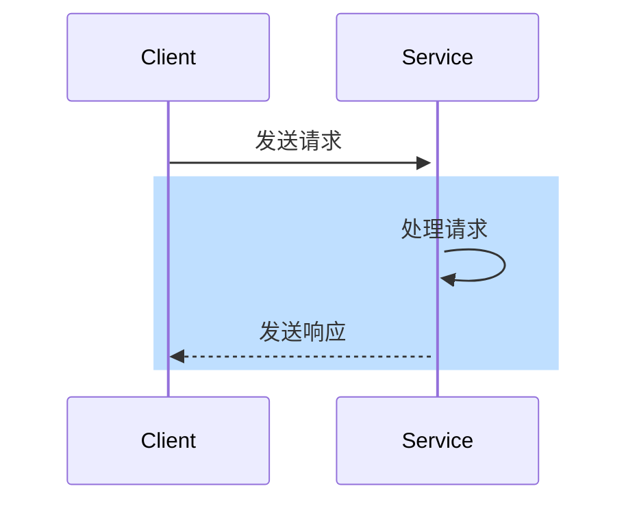

# Markdown使用说明

## 标题

> 有几个#代表几级标题
>
> ```markdown
> # 一级标题
> ## 二级标题
> ```

>快捷键：
>
>ctrl+1~6对应各级标题

## 段落

### 换行

>```markdown
>段落一
>段落二
>```

### 分割线

>```markdown
>---
>***
>```

## 文字显示

### 字体

> - 粗体：
>
>   ```markdown
>   **粗体**
>   ```
>
> - 斜体：
>
>   ```markdown
>   *斜体*
>   ```
>
> - 删除线：
>
>   ```markdown
>   ~~删除线~~
>   ```
>
> - 下划线：
>
>   ```markdown
>   <u>下划线</u>
>   ```
>
> - 高亮：
>
>   ```markdown
>   ==高亮==
>   ```

> 快捷键：
>
> - 加粗 Ctrl+B
> - 斜体 Ctrl+I
> - 删除线 Ctrl+U
> - 删除线 Shift+Alt+5

### 上下标

> ```markdown
> x^2^
> H~2~O
> ```

## 列表

### 无序列表

> ```markdown
> 加空格
> - 
> + 
> * 
> ```

> 快捷键：Ctrl+Shift+]
>
> 按tab进行多级分类

### 有序列表

> ```markdown
> 数字.+空格
> 1. 
> 2. 
> ```

> 快捷键：Ctrl+Shift+[

### 任务清单

> ```markdown
> - [ ] 背单词
> ```
>
> - [ ] 背单词

## 区块显示

> ```markdown
> >+Enter
> ```
>
> Ctrl+Shift+Q
>
> 取消是按两下Enter
>
> 可以嵌套，>>

## 代码显示

#### 代码行

> `int a=0;`
>
> Ctrl+Shift+`

#### 代码块

> ```
> code
> ```
>
> Ctrl+Shift+K

## 链接

> ```markdown
> www.baidu.com
> [百度一下](https://www.baidu.com)
> ```
>
> Ctrl+K

## 脚注

>```markdown
>[^脚注]:解释说明
>```

## 图片插入

>```markdown
>
>```

## 表格

> ```markdown
> |      |      |      |
> | ---- | ---- | ---- |
> |      |      |      |
> |      |      |      |
> |      |      |      |
> ```
>
> |      |      |      |
> | ---- | ---- | ---- |
> |      |      |      |
> |      |      |      |
> |      |      |      |
>
> Ctrl+T
>
> 下方插入行：Ctrl+Enter
>
> 删除当前行： Ctrl+ Shift+Backspace
>
> 要添加表，请使用三个或多个连字符（`---`）创建每列的标题，并使用管道（`|`）分隔每列。您可以选择在表的任一端添加管道。
>
> ```text
> | Syntax      | Description |
> | ----------- | ----------- |
> | Header      | Title       |
> | Paragraph   | Text        |
> ```

### 对齐

> 在标题行中的连字符的左侧，右侧或两侧添加冒号（`:`），将列中的文本对齐到左侧，右侧或中心。
>
> ```markdown
> | Syntax      | Description | Test Text     |
> | :---        |    :----:   |          ---: |
> | Header      | Title       | Here's this   |
> | Paragraph   | Text        | And more      |
> ```
>
> 

## 流程图

>````
><!-- 此处的内容会被渲染成 mermaid 图形 -->
>```mermaid
>```
>````

> 基本的流程图包含：流程图布局方向、几何图形和连接线三个部分组成。

### 横向

>````
>```mermaid
>graph LR
>    开始 --> 结束
>```
>````

> ```mermaid
> graph LR
>     开始 --> 结束
> ```

### 竖向

> ````
> ```mermaid
> graph TD
>     开始 --> 结束
> ```
> ````
>
> 

> ```mermaid
> graph TD
>     开始 --> 结束
> ```

>| 标志 |         方向          |
>| :--: | :-------------------: |
>|  TB  | top bottom - 从上到下 |
>|  BT  | bottom top - 从下到上 |
>|  RL  | right left - 从右到左 |

### 几何图形

> 默认的几何图形：
>
> ```mermaid
> graph LR
>     几何图形中的文本内容
> ```

> 如果图形中的文本较长，或者文本内容不足以体现图形的唯一性，可将图形节点的 ID 与其文本内容分开定义，以使结构更加清晰。
>
> ```mermaid
> graph LR
>     一号节点[在此输入希望在一号节点上显示的文字内容]
> ```

---

- 圆角形()

  ```mermaid
  graph TD
  	节点ID(节点显示文本)
  ```

- 圆形(())

  ```mermaid
  graph TD
  	节点ID((节点显示文本))
  ```

- 非对称形> ]

  ```mermaid
  graph TD
  	节点ID>节点显示文本]
  ```

- 菱形{}

  ```mermaid
  graph TD
  	节点ID{节点显示文本}
  ```

- 六角形{{}}

  ```mermaid
  graph TD
  	节点ID{{节点显示文本}}
  ```

- 平行四边形 [//] [\\\\\]

  ```mermaid
  graph TD
  	右倾平行四边形[/平行四边形--右倾/]
  	左倾平行四边形[\平行四边形--左倾\]
  ```

- 梯形[/\\]

  ```mermaid
  graph TD
    梯形[/梯形--正向\]
  	反向梯形[\梯形--反向/]
  ```

### 连接线

````

````


> 无方向的连接线可用来表示相关性、有方向的连接线可以表示数据流向或者节点间的依赖关系；用实线表示强关联、用虚线表示弱关联等。

- 无向线段连接线

  ````
  ```mermaid
  graph LR
      A --- B -- 带文字连接线 --- C
  ```
  ````

  ```mermaid
  graph LR
      A --- B -- 带文字连接线 --- C
  ```

- 点状连接线

  ````
  ```mermaid
  graph LR
      A -.- B -. 带文字连接线 .-> C
  ```
  ````

  ```mermaid
  graph LR
      A -.- B -. 带文字连接线 .-> C
  ```

- 粗实连接线

  ````
  ```mermaid
  graph LR
      A ==> B == 带文字连接线 ==> C
  ```
  ````

  ```mermaid
  graph LR
      A ==> B == 带文字连接线 ==> C
  ```

### 视图分组

````


````


## 时序图

> 时序图 (Sequence Diagram) ，用来体现对象之间的时间顺序关系，可以表达出对象的交互过程，也就是 “从哪到哪” 的图形化描述。

> 绘制时序图，必须包含时序图类型声明、对象及消息三个部分。

### 基本时序图

````

````


以别名形式定义对象：

````

````


| 类型 | 描述             |
| ---- | ---------------- |
| ->   | 没有箭头的实线   |
| –>   | 没有箭头的虚线   |
| ->>  | 有箭头的实线     |
| –>>  | 有箭头的虚线     |
| -x   | 有交叉箭头的实线 |
| –x   | 有交叉箭头的虚线 |

> 聚焦代表一条消息在其对象的生命周期中的处理活动。
>
> 从消息接收方 的时间上上标记一小段时间，表示对消息进行处理的时间间隔。

````

````


> 聚焦可以使用 `+` / `-` 符号简化书写。

```
sequenceDiagram
    李雷->>+韩梅梅: Hello, what's your name?
    韩梅梅-->>-李雷: Hello, my name is Hanmeimei!
```

> 在参与者的生命线右侧增加备注。

````

````


> 在参与者的生命线之上增加备注。

````

````


### 时序图逻辑 

1. 循环

   ```
   loop  消息说明
   	[消息流]
   end
   ```

   ````
   ```mermaid
   sequenceDiagram
       李雷->韩梅梅: Hello Hanmeimei, how are you?
       loop 不停地说
           韩梅梅-->李雷: Great!
       end
   ```
   ````

   ```mermaid
   sequenceDiagram
       李雷->韩梅梅: Hello Hanmeimei, how are you?
       loop 不停地说
           韩梅梅-->李雷: Great!
       end
   ```

2. 选择

   ```
   alt 条件说明
   	[消息流]
   else 
   	[消息流]
   else 
   	[消息流]
   end
   ```

   ```
   	```mermaid
   	sequenceDiagram
   		土豪 ->> + 取款机 : 查询余额
   		取款机 -->> - 土豪: 余额
   		
   		alt 余额 > 5000 
   			土豪 ->> 取款机 : 取上限5000块
   		else 100 < 余额 < 5000
   			土豪 ->> 取款机 : 有多少取多少
   		else 余额 < 100 
   			土豪 ->> 取款机 : 退卡
   		end 
   		
   		取款机 -->> 土豪 : 退卡成功
   	```
   ```

   ```mermaid
   	sequenceDiagram
   		土豪 ->> + 取款机 : 查询余额
   		取款机 -->> - 土豪: 余额
   		
   		alt 余额 > 5000 
   			土豪 ->> 取款机 : 取上限5000块
   		else 100 < 余额 < 5000
   			土豪 ->> 取款机 : 有多少取多少
   		else 余额 < 100 
   			土豪 ->> 取款机 : 退卡
   		end 
   		
   		取款机 -->> 土豪 : 退卡成功
   ```

3. 可选

```
opt  条件说明
	[消息流]
end
```

````

````


4. 并行：

   ```
   par 说明
   	[消息流]
   and 
   	[消息流]
   and
   	……
   end
   ```

   ````
   ```mermaid
   	sequenceDiagram
   		老板 ->> 员工 : "开始996"
   		
   		par 上班时间
   			员工 ->> 员工 : 工作
   		and 
   			员工 ->> 员工 : 刷微博
   		and 
   			员工 ->> 员工 : 刷朋友圈
   		end
   		
   		员工 -->> 老板 : 下班
   ```
   ````

   ```mermaid
   	sequenceDiagram
   		老板 ->> 员工 : "开始996"
   		
   		par 上班时间
   			员工 ->> 员工 : 工作
   		and 
   			员工 ->> 员工 : 刷微博
   		and 
   			员工 ->> 员工 : 刷朋友圈
   		end
   		
   		员工 -->> 老板 : 下班
   ```

### 背景颜色

```
rect rgb(191, 222, 233)
	[消息流]
end
```

````

````


## 类图

## 状态图

## 甘特图

## 饼图

## 表情符号

> ```markdown
> :happy:
> ```
>
> :happy:

## 数学公式

### 公式的插入

#### 公式行

> ```markdown
> $公式$(Latex)
> $S=\pi r^2$
> ```
>
> $S=\pi r^2$

#### 公式块

> ```markdown
> $$
> 公式
> $$
> ```

## 支持的HTML元素

### 文本居中

> ```
> <center>内容</center>
> ```

### 快捷键显示

> ```
> <kbd>内容</kbd>
> ```

### 加粗

> ```
> <b></b>
> ```

### 倾斜

> ```
> <i></i>
> ```

### 上下标

> ```
> H<sup>1</sup>
> H<sub>1</sub>
> ```

> H<sup>1</sup>
> H<sub>1</sub>

## 目录

使用 `[TOC]` 生成文档目录导航，凡是以 `#` 定义的标题都会被编排到目录中。
